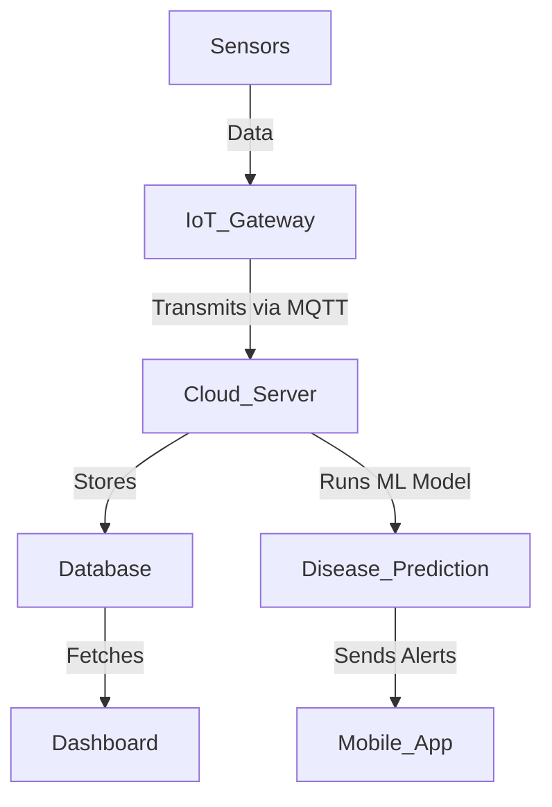

# 🍅 End-to-End Solution for Smart Tomato Cultivation

## 🌱 Overview
This project presents a **smart and data-driven approach** to tomato cultivation by integrating **IoT, Machine Learning, and Cloud Computing**. The goal is to **monitor environmental conditions, detect plant diseases, and optimize farming strategies** using real-time data and predictive analytics.

## 🚀 Features
✅ **IoT-based Monitoring** – Collects real-time data on temperature, humidity, soil moisture, and other key parameters using sensors.  
✅ **Crop Disease Detection** – Uses **image-based ML models** to classify plant diseases and suggest remedial actions.  
✅ **Data Visualization** – Displays insights through interactive dashboards for easy farm monitoring.  
✅ **MQTT-based Communication** – Ensures seamless data transmission between sensors and cloud servers.  
✅ **Automated Alerts** – Notifies farmers about adverse conditions and recommends corrective measures.  
✅ **Cloud Deployment** – Supports integration with cloud platforms like **Azure** for scalability and accessibility.  

## 🛠 Tech Stack
- **Embedded Systems** (ESP32, Raspberry Pi)
- **IoT Protocols** (MQTT, HTTP)
- **Machine Learning** (TensorFlow, OpenCV)
- **Cloud Services** (Azure, Firebase)
- **Database** (MySQL, Firebase Realtime Database)
- **Frontend** (React.js for dashboards)
- **Backend** (FastAPI, Node.js)

## 📊 System Architecture


## ⚙️ Installation & Setup
1. **Clone the repository:**
   ```sh
   git clone https://github.com/shreyash4145/End-to-end-solution-for-smart-tomato-cultivation.git
   cd End-to-end-solution-for-smart-tomato-cultivation
   ```
2. **Install dependencies:**
   ```sh
   pip install -r requirements.txt  # For backend (FastAPI, ML models)
   npm install  # For frontend (React.js dashboard)
   ```
3. **Run the backend server:**
   ```sh
   uvicorn main:app --reload
   ```
4. **Start the frontend:**
   ```sh
   npm start
   ```

## 📌 Future Enhancements
🔹 AI-powered **crop yield prediction**  
🔹 **Automated irrigation control** based on soil moisture levels  
🔹 Blockchain-based **supply chain tracking**  
 
🔗 [GitHub Profile](https://github.com/shreyash4145)  

---
*Empowering farmers with technology for a smarter, more sustainable future!* 🌍🚜
